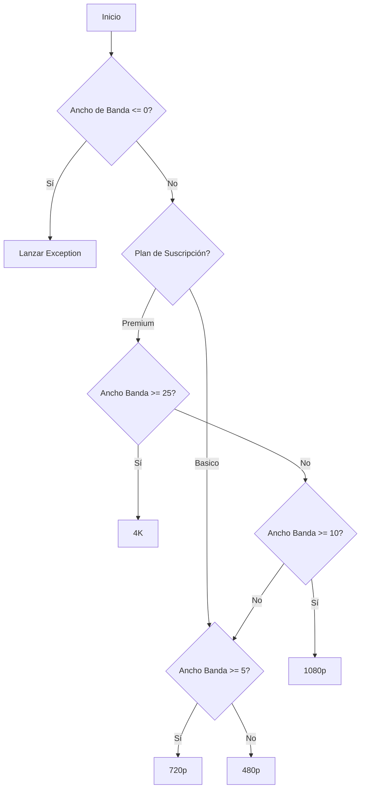
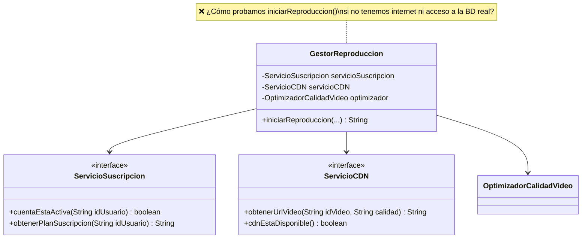
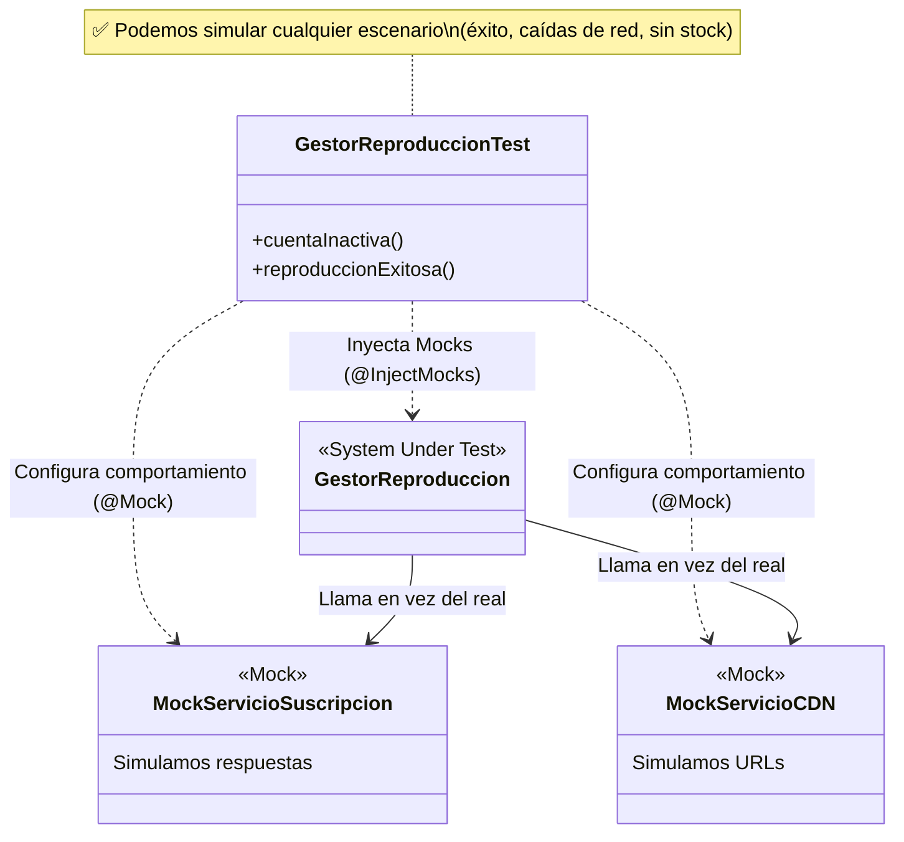

# Laboratorio: Pruebas Unitarias, Mocks y Pruebas de Mutación

---

## Caso de Estudio: Sistema de Streaming de Video

Una empresa de streaming (estilo Netflix) necesita optimizar cómo se asigna la calidad de video a sus usuarios, basándose en su conexión a internet, el dispositivo que utilizan y su plan de suscripción. Además, cuenta con un orquestador que se conecta a los servicios de suscripción y a su Red de Distribución de Contenido (CDN).

---

## Preparación del Proyecto

El proyecto actual (`Lab009`) es un proyecto Maven preconfigurado con:
- JUnit 5 (`junit-jupiter-engine`)
- Mockito (`mockito-core`, `mockito-junit-jupiter`)
- PITest (`pitest-maven` plugin)

Abre el proyecto en tu IDE favorito y verifica que las dependencias se descarguen correctamente (`mvn clean compile`).

---

## Ejercicio 1: Pruebas Unitarias Básicas y Pruebas de Mutación

### 1) Entendiendo la Lógica:

El archivo `OptimizadorCalidadVideo.java` contiene la lógica para asignar la calidad de video:

### 2) Pruebas Unitarias (JUnit 5):

Dirígete a `src/test/java/com/ulima/is2/streaming/ejercicio01/OptimizadorCalidadVideoTest.java`. Verás algunas pruebas comentadas o incompletas.

**Tu tarea:**
- Descomenta y completa las pruebas iniciales.
- Añade nuevas pruebas usando `@Test` y asegúrate de probar todos los caminos (if-else) posibles.
- Considera valores límite (por ejemplo, ¿qué pasa si el ancho de banda es exactamente 5.0?).

<b>Haz clic aquí para ver el listado de pruebas recomendado</b>

Para garantizar el 100% de cobertura y pasar las pruebas de mutación (PITest), asegúrate de implementar las siguientes pruebas (usando estos nombres u otros similares):

**Pruebas de Validación (Errores):**
- `optimizar_anchoDeBandaNegativo_lanzaIllegalArgumentException` (ej: `-1.0`)

**Pruebas para el Plan Básico:**
- `optimizar_planBasicoAnchoBandaMenorA5_retorna480p` (ej: `4.9`)
- `optimizar_planBasicoAnchoBandaMayorA5_retorna720p` (ej: `6.0`)

**Pruebas para el Plan Premium:**
- `optimizar_planPremiumAnchoBandaMenorA5_retorna480p`
- `optimizar_planPremiumAnchoBandaMenorA10_retorna720p` (ej: `9.9`)
- `optimizar_planPremiumAnchoBandaMenorA25_retorna1080p` (ej: `24.9`)
- `optimizar_planPremiumAnchoBandaMayorA25_retorna4K`

### 3) Pruebas de Mutación (PITest):

Una vez que creas que tienes suficientes pruebas, vamos a evaluar su calidad. PITest creará "mutantes" (cambiará `>` por `>=`, o `true` por `false` en el código de producción) y ejecutará tus pruebas. 

Si tus pruebas **fallan**, significa que detectaron el cambio y el mutante fue **asesinado**. Si tus pruebas **pasan**, el mutante ha **sobrevivido** (lo cual es malo, significa que te faltan pruebas).

**Tu tarea:**
1. Ejecuta en tu terminal: `mvn pitest:mutationCoverage`
2. Ve a la carpeta `target/pit-reports/` y abre el `index.html` en tu navegador.
3. Observa la cobertura de línea (Line Coverage) y la cobertura de mutación (Mutation Coverage).
4. **Reto:** Cuando veas que tu Mutation Coverage no es 100%, descubre qué pruebas **faltan** en `OptimizadorCalidadVideoTest` y añádelas hasta lograr el **100% de Mutation Coverage**.
   

   
<b>💡 Pista (¡Lee esto si te estancas!)</b>

   
   PITest genera mutantes que cambian las condiciones de frontera (ej. cambiar `>=` por `>`). Para matarlos a todos, necesitas crear pruebas adicionales con los **valores límite exactos** (0.0, 5.0, 10.0 y 25.0).
   
   Implementa exactamente estas pruebas:
   - `optimizar_anchoDeBandaCero_lanzaIllegalArgumentException` (0.0)
   - `optimizar_planBasicoAnchoBandaExactamente5_retorna720p` (5.0)
   - `optimizar_planPremiumAnchoBandaExactamente5_retorna720p` (5.0)
   - `optimizar_planPremiumAnchoBandaExactamente10_retorna1080p` (10.0)
   - `optimizar_planPremiumAnchoBandaExactamente25_retorna4K` (25.0)
   
   ¡Añádelas y vuelve a ejecutar!
   

---

## Ejercicio 2: Uso de Mocks con Mockito

### 1) El Problema de las Dependencias:

En el ejercicio 2 tenemos la clase `GestorReproduccion` que depende de servicios externos que simulan conexiones a bases de datos o APIs externas.

### 2) La Solución: Mocking

Para probar el `GestorReproduccion` sin llamar a los servicios reales, usaremos Mocks.

### 3) Instrucciones:

Dirígete a `src/test/java/com/ulima/is2/streaming/ejercicio02/GestorReproduccionTest.java`.

**Tu tarea:**
- Descomenta y completa las pruebas iniciales.
- Usa `when(mock.metodo()).thenReturn(valor)` para simular respuestas específicas de los servicios según el escenario.
- Usa `verify(mock).metodo()` o `verifyNoInteractions(mock)` para asegurar que el `GestorReproduccion` se está comportando correctamente según el caso.
- Completa las pruebas que se proporcionan como base, cubriendo un escenario de error y el flujo de ejecución exitosa de `iniciarReproduccion`.

<b>Haz clic aquí para ver el listado de pruebas recomendado</b>

Para probar la lógica de `GestorReproduccion`, asegúrate de completar los siguientes escenarios utilizando *mocks* que ya se encuentran en el código:

**Escenarios de Error:**
- `cuentaInactiva`

**Escenario de Éxito:**
- `reproduccionExitosa`

---

_Recuerda: El objetivo de este laboratorio no es solo que las pruebas pasen en verde, sino escribir pruebas de alta calidad que realmente protejan al código de futuros errores._

---

## Criterios de Cumplimiento

Para considerar este laboratorio como completado satisfactoriamente, el estudiante deberá cumplir con lo siguiente:

1. **Ejercicio 1:**
   - Implementar todas las pruebas unitarias requeridas en `OptimizadorCalidadVideoTest.java`, asegurando la evaluación de las rutas críticas y valores límite (ej. 0.0, 5.0, 10.0, 25.0).
   - Lograr un **100% de Mutation Coverage** tras ejecutar PITest (`mvn pitest:mutationCoverage`). Todos los mutantes generados deben ser "asesinados".

2. **Ejercicio 2:**
   - Desplegar adecuadamente las anotaciones `@Mock` e `@InjectMocks` en `GestorReproduccionTest.java`.
   - Completar exitosamente la prueba `cuentaInactiva`, validando el retorno esperado y asegurando con `verifyNoInteractions` la nula interacción con otros mocks no involucrados en este escenario temprano de falla.
   - Completar exitosamente la prueba `reproduccionExitosa`, configurando los retornos con `when(...)` y ratificando que cada dependencia externa (Suscripción, CDN, Optimizador) fue llamada con los parámetros correctos mediante los métodos `verify(...)`.
   - La ejecución de `mvn test` debe completarse sin errores.
