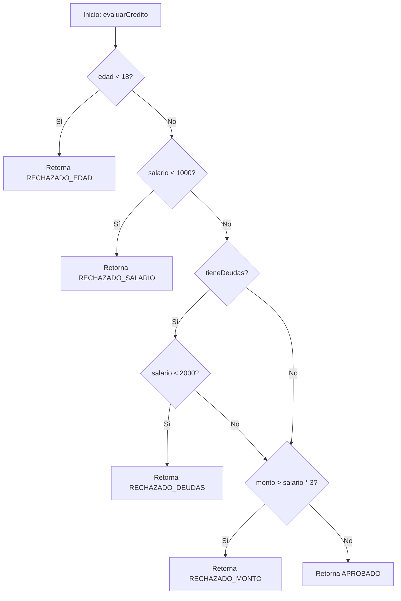

# Laboratorio 10: Pruebas de Caja Blanca y Caja Negra

---

## Ejercicio 0: 

Trabajar con aplicación web (API):

- [https://github.com/jsatch/2026-1.API_Test_Carga](https://github.com/jsatch/2026-1.API_Test_Carga)


### Paso 1 — Crear el Test Plan 

1. Abrir JMeter (`jmeter.bat` en Windows o `./jmeter.sh` en Linux/Mac, dentro de la carpeta `bin/`).
2. Clic derecho sobre **Test Plan** → `Add` → `Threads (Users)` → **Thread Group**.
3. Renombrar el Thread Group como `Usuarios Concurrentes`.

### Paso 2 — Configurar el Thread Group (0:20 – 0:25)

Configurar los siguientes parámetros y **registrar en su informe el porqué de cada valor elegido**:

| Parámetro | Valor sugerido | Significado |
|---|---|---|
| Number of Threads (users) | 20 | Usuarios virtuales simulados |
| Ramp-up period (seconds) | 10 | Tiempo en que JMeter "enciende" gradualmente todos los hilos |
| Loop Count | 5 | Veces que cada usuario repite la petición |

### Paso 3 — Agregar el HTTP Request Sampler

1. Clic derecho sobre el Thread Group → `Add` → `Sampler` → **HTTP Request**.
2. Configurar:
   - **Server Name or IP:** `localhost` (o el host de su aplicación)
   - **Port:** `8080` (o el puerto correspondiente)
   - **Method:** `GET`
   - **Path:** `/api/estudiantes` (o el endpoint de su propia aplicación)

### Paso 4 — Agregar Listeners

Sobre el Thread Group, agregar dos listeners:

1. `Add` → `Listener` → **View Results Tree** (permite inspeccionar petición/respuesta individual — útil para depurar).
2. `Add` → `Listener` → **Summary Report** (entrega métricas agregadas: promedio, mínimo, máximo, % error, throughput).

### Paso 5 — Ejecutar la prueba

1. Guardar el Test Plan (`Ctrl+S`).
2. Ejecutar con el botón ▶ (Start).
3. Observar en tiempo real cómo se llenan los listeners.


### Paso 6 — Analizar resultados

En el **Summary Report**, identificar y registrar:

| Métrica | ¿Qué indica? |
|---|---|
| **# Samples** | Total de peticiones ejecutadas |
| **Average** | Tiempo de respuesta promedio (ms) |
| **Min / Max** | Rango de tiempos de respuesta |
| **Error %** | Porcentaje de peticiones fallidas |
| **Throughput** | Peticiones procesadas por segundo |

---

## Ejercicio 1: Pruebas de Caja Blanca (Coverage y Caminos Independientes)

> **¿Qué son las Pruebas de Caja Blanca?**  
> Consisten en probar el sistema conociendo su código fuente y estructura interna, con el objetivo de verificar que todos los flujos lógicos se ejecuten correctamente.

### Contexto: Evaluador de Crédito
Se ha implementado una clase `EvaluadorCredito` que decide si se aprueba o se rechaza un crédito para un cliente basado en diversas reglas de negocio. Requiere un análisis de **Caja Blanca** para asegurar que todos los caminos de ejecución sean probados adecuadamente.

### 1) Grafo de Flujo (Flujo de Control)

El método `evaluarCredito` contiene la siguiente lógica de decisión. A continuación se presenta el **Grafo de Flujo**:



### 2) Tareas:
1. **Cálculo de Complejidad Ciclomática:** En el archivo [RESPUESTAS.md](./RESPUESTAS.md), calcula matemáticamente la complejidad ciclomática de este método.
   <details>
   <summary><b>💡 ¿Cómo calcular la Complejidad Ciclomática? (Ver ejemplo)</b></summary>
   
   La complejidad ciclomática (V(G)) mide el número de caminos independientes en tu código. La forma más rápida de calcularla analizando el código fuente es **contar los nodos de decisión lógicos (`if`, `while`, `for`, `case`) y sumar 1**.

   **Ejemplo de código:**
   ```java
   public String verificarAcceso(int edad, boolean tienePase) {
       if (edad < 18) { // Decisión 1
           return "Acceso Denegado: Menor de edad";
       }
       if (tienePase) { // Decisión 2
           return "Acceso VIP";
       }
       return "Acceso Estándar";
   }
   ```
   **Cálculo detallado:**
   - **Nodos de Decisión:** En el código observamos exactamente **2** sentencias `if`.
   - **Fórmula:** `V(G) = Nodos de Decisión + 1` *(El "+1" representa el camino base o flujo principal del programa. Cada decisión adicional crea una nueva desviación, sumando un camino más al flujo original).*
   - **Cálculo:** `2 + 1 = 3` 
   - **Resultado:** La complejidad es **3**, lo que significa que necesitarás un mínimo de 3 casos de prueba para cubrir todas las rutas de este método.
   </details>
2. **Caminos Independientes:** Lista los caminos independientes obtenidos a partir del Grafo de Flujo en el archivo [RESPUESTAS.md](./RESPUESTAS.md).
3. **Casos de Prueba (JUnit 5):** Abre `EvaluadorCreditoTest.java`. Verás que ya te hemos regalado **2 tests resueltos**. Tu tarea es implementar los **4 restantes** usando `@Test`.
   - Ejecuta las pruebas mediante Maven: `mvn test` o desde tu IDE para asegurar que todo pasa correctamente.

---

## Ejercicio 2: Pruebas de Caja Negra (Partición de Equivalencia)

> **¿Qué son las Pruebas de Caja Negra?**  
> Consisten en validar la funcionalidad de un sistema evaluando únicamente sus entradas y salidas esperadas frente a los requisitos, sin examinar su código fuente.

### Contexto: Validador de Registro de Usuarios
Para que un usuario pueda registrarse en el sistema, debe enviar cierta información que es validada por la clase `ValidadorRegistro`.

El método `registrarUsuario(String nombre, String email, int edad, String tipoDocumento, String numeroDocumento)` acepta 5 parámetros y los valida bajo las siguientes reglas:
1. `nombre`: No puede estar vacío ni ser nulo.
2. `email`: Debe contener al menos un arroba (`@`).
3. `edad`: Debe ser mayor o igual a 18.
4. `tipoDocumento`: Solo se aceptan los valores `"DNI"` o `"CE"`.
5. `numeroDocumento`: Debe tener exactamente 8 caracteres (sin importar el tipo).

Al ser un sistema basado en validaciones de entradas sin importar su implementación interna, usaremos la técnica de **Caja Negra**.

### Tareas:
1. **Tabla de Clases de Equivalencia:** Abre el archivo [RESPUESTAS.md](./RESPUESTAS.md) y completa la tabla identificando las clases de equivalencia Válidas e Inválidas para cada uno de los 5 parámetros.
2. **Casos de Prueba:** En [RESPUESTAS.md](./RESPUESTAS.md), diseña **1 solo Caso de Prueba Válido** y **2 Casos de Prueba Inválidos**.
3. **Automatización de Pruebas (JUnit 5):** Dirígete a `ValidadorRegistroTest.java` e implementa en código los 3 casos que diseñaste en tus tablas. Las plantillas ya están listas.
