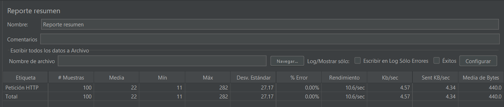
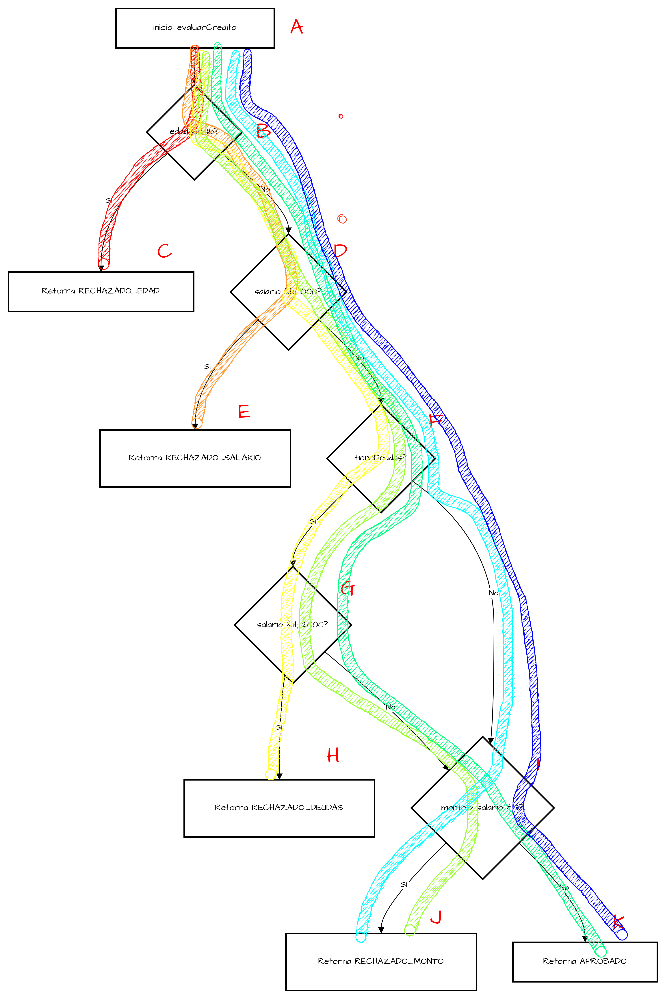

# Hoja de Respuestas - Laboratorio 10

**Nombre:** Samantha Rodriguez
**Código:** 20232548

---

## Ejercicio 1: Caja Blanca (Evaluador de Créditos)

### 1.1) Cálculo de Complejidad Ciclomática
*V(G) = Nodos de Decisión + 1* \
*V(G) = 5+1*\
*V(G) = 6*

- **Fórmula:** (Ej: Complejidad Ciclomática (V(G)) = Nodos de Decisión + 1)
- **Resultado:** (Ej: 3 + 1 = 4)

### 1.2) Caminos Independientes
*Camino 1: A (Inicio) -> B(Sí) -> C (Rechazado por edad)*

*Camino 2: A (Inicio) -> B(No) -> D(Sí) -> E (Rechazado por salario mínimo)*

*Camino 3: A -> B(No) -> D(No) -> F(Sí) -> G(Sí) -> H (Rechazado por deudas con salario bajo)*

*Camino 4: A -> B(No) -> D(No) -> F(Sí) -> G(No) -> I(Sí) -> J (Rechazado por monto excesivo teniendo deudas y buen salario)*

*Camino 5: A -> B(No) -> D(No) -> F(Sí) -> G(No) -> I(No) -> K (Aprobado)*

*Camino 6: A -> B(No) -> D(No) -> F(No) -> I(Sí) -> J (Rechazado por monto excesivo sin tener deudas)*

El que queda \
*Camino 7: A -> B(No) -> D(No) -> F(No) -> I(No) -> K (Aprobado)*

--

## Ejercicio 2: Caja Negra (Validador de Registro)

### 2.1) Tabla de Clases de Equivalencia

| Campo | Clases de Equivalencia Válidas | Clases de Equivalencia Inválidas |
|-------|--------------------------------|----------------------------------|
| Nombre | Cadena de texto válida (no vacía ni nula)            | Cadena vacía (Ej: "") o nula                        |
| Email | Contiene al menos un carácter @ (Ej: a@gmail.com)                   | No contiene el carácter @ (Ej: a.com)                         |
| Edad | Número entero mayor o igual a 18 (Ej: 20)                            | Número entero menor a 18 (Ej: 15)                             |
| Tipo de Documento | Valores estrictos permitidos: "DNI" o "CE"                            | Cualquier otro valor distinto (Ej: "Carnet Estudiantil")             |
| Número de Documento | Longitud exacta de 8 caracteres (Ej: 72571859)                  | Longitud distinta a 8 caracteres (Ej: 1265415216525)              |

### 2.2) Tabla de Casos de Prueba Válidos (Flujo Ideal)

| ID | Nombre         | Email            | Edad | Tipo Doc. | Num. Doc. | Resultado Esperado        |
|---|----------------|------------------|------|-----------|-----------|---------------------------|
| CP-V-01 | Juan Perez     | juan@test.com    | 25   | DNI       | 12345678  | true *(Ejemplo resuelto)* |
| CP-V-02 | Gustabo Garcia | ggarcia@test.com | 32   | DNI       | 89456123  | true *(Ejemplo correcto)* |

### 2.3) Tabla de Casos de Prueba Inválidos (Flujos de Error)

| ID | Nombre | Email | Edad | Tipo Doc. | Num. Doc. | Resultado Esperado |
|---|--------|-------|------|-----------|-----------|--------------------|
| CP-I-01 |  | juan@test.com | 25 | DNI | 12345678 | false *(Ejemplo: Nombre vacío)* |
CP-I-02 | Ana Gomez | anagomez.com | 22 | DNI | 12345678 | false *(Email sin arroba)* |
| CP-I-03 | Luis Arce | luis@test.com | 28 | DNI | 12345 | false *(Número de documento con menos de 8 caracteres)* |

---
*(Recuerda que estas tablas te servirán de base para construir tus pruebas en JUnit 5 dentro del proyecto)*
